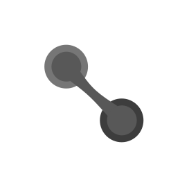
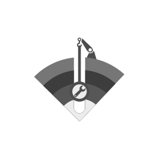

  

# Accreta

Plataforma distribuida y open-source para la especificación colaborativa de software. Modela la co-creación de specs vivas como un proceso de acreción: las contribuciones de humanos y agentes se acumulan capa por capa, con historial completo y gobernanza por consenso.

→ [Visión general](overview.md) · [Arquitectura](architecture.md)

---

## Subsistemas

<table> <tr> <td align="center" width="160">     <b>Stratum</b> </td> <td> Estructura de capas para organizar el conocimiento de un proyecto: specs, decisiones técnicas, implementación. Define el modelo de layers y el lenguaje de paths para navegar entre ellas.  <a href="subsystems/stratum/overview.md">Overview</a> · <a href="subsystems/stratum/architecture.md">Arquitectura</a> · <a href="subsystems/stratum/concepts/layer-model.md">Layer model</a> · <a href="subsystems/stratum/concepts/paths.md">Paths</a> </td> </tr> <tr> <td align="center">     <b>Bilinker</b> </td> <td> Referencias verificables entre fragmentos de distintas capas. Detecta cuando un fragmento linkedeado cambia y propaga el estado a través de la cadena.  <a href="subsystems/bilinker/overview.md">Overview</a> · <a href="subsystems/bilinker/architecture.md">Arquitectura</a> · <a href="subsystems/bilinker/concepts/bilink.md">Formato bilink</a> · <a href="subsystems/bilinker/concepts/consistency.md">Consistencia</a> · <a href="subsystems/bilinker/commands/check.md">check</a> · <a href="subsystems/bilinker/commands/graph.md">graph</a> · <a href="subsystems/bilinker/commands/chain.md">chain</a> </td> </tr> <tr> <td align="center">     <b>Impact</b> </td> <td> Análisis de cambios entre capas linkedeadas. Dado un archivo modificado, calcula el alcance del cambio, identifica las chains afectadas y abre hilos de discusión estructurados.  <a href="subsystems/impact/overview.md">Overview</a> · <a href="subsystems/impact/architecture.md">Arquitectura</a> · <a href="subsystems/impact/concepts/blast-radius.md">Blast radius</a> · <a href="subsystems/impact/commands/scan.md">scan</a> </td> </tr> <tr> <td align="center">     <b>Worklist</b> </td> <td> Registro del trabajo concreto pendiente. Cada ítem nace linkedeado al fragmento que lo origina. IDs cortos base-36 asignados por servidor git central.  <a href="subsystems/worklist/overview.md">Overview</a> · <a href="subsystems/worklist/architecture.md">Arquitectura</a> · <a href="subsystems/worklist/concepts/item.md">Ítems</a> · <a href="subsystems/worklist/commands/new.md">new</a> · <a href="subsystems/worklist/commands/done.md">done</a> </td> </tr> </table>

---

## Licencia

[LICENSE](LICENSE)
