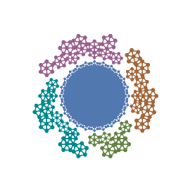
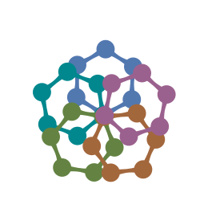
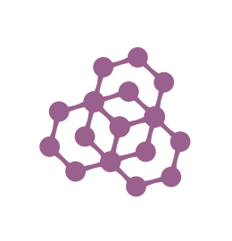
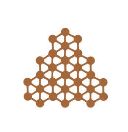
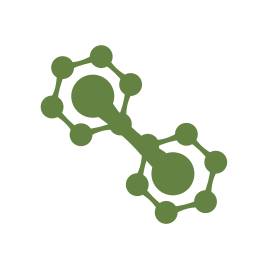

# accreta

Plataforma distribuida y open-source para la especificación colaborativa de software. Modela la co-creación de specs vivas como un proceso de acreción: las contribuciones de humanos y agentes se acumulan capa por capa, con historial completo y gobernanza por consenso.

→ [Visión general](overview.md) · [Arquitectura](architecture.md)

---

## Pila de sistemas

<table> <tr> <td align="center">     <b>accreta</b> </td> <td> Colaborar organizativamente a la velocidad de la IA (WIP) </td> </tr> <tr> <td align="center">     <b>graviton</b> </td> <td> Supervision multiproyecto (WIP) </td> </tr> <tr> <td align="center">     <b>lattice</b> </td> <td> Grafo unificado de las conexiones del proyecto. Agrega las referencias verificadas de bilinker, las llamadas derivadas del LSP y los links entre documentos — cada arista con su procedencia y su nivel de garantía.  <a href="subsystems/lattice/overview.md">Overview</a> · <a href="subsystems/lattice/architecture.md">Arquitectura</a> · <a href="subsystems/lattice/concepts/edge.md">Aristas</a> · <a href="subsystems/lattice/concepts/node.md">Nodos</a> · <a href="subsystems/lattice/concepts/provider.md">Proveedores</a> · <a href="subsystems/lattice/commands/graph.md">graph</a> </td> </tr> <tr> <td align="center">     <b>muckpile</b> </td> <td> Registro del trabajo concreto pendiente.  <a href="subsystems/muckpile/overview.md">Overview</a> · <a href="subsystems/muckpile/architecture.md">Arquitectura</a> · <a href="subsystems/muckpile/concepts/item.md">Ítems</a> · <a href="subsystems/muckpile/commands/new.md">new</a> · <a href="subsystems/muckpile/commands/done.md">done</a> </td> </tr> <tr> <td align="center" width="160">     <b>stratum</b> </td> <td> Estructura de capas para organizar el conocimiento de un proyecto: specs, decisiones técnicas, implementación. Define el modelo de layers y el lenguaje de paths para navegar entre ellas.  <a href="subsystems/stratum/overview.md">Overview</a> · <a href="subsystems/stratum/architecture.md">Arquitectura</a> · <a href="subsystems/stratum/concepts/layer-model.md">Layer model</a> · <a href="subsystems/stratum/concepts/paths.md">Paths</a> </td> </tr> <tr> <td align="center">     <b>bilinker</b> </td> <td> Referencias verificables entre fragmentos de distintas capas. Detecta cuando un fragmento linkedeado cambia y propaga el estado a través de la cadena.  <a href="subsystems/bilinker/overview.md">Overview</a> · <a href="subsystems/bilinker/architecture.md">Arquitectura</a> · <a href="subsystems/bilinker/concepts/bilink.md">Formato bilink</a> · <a href="subsystems/bilinker/concepts/consistency.md">Consistencia</a> · <a href="subsystems/bilinker/commands/check.md">check</a> · <a href="subsystems/bilinker/commands/graph.md">graph</a> · <a href="subsystems/bilinker/commands/chain.md">chain</a> </td> </tr> </table>

---

## Licencia

`MIT OR Apache-2.0`, a elección de quien lo use — [LICENSE-MIT](LICENSE-MIT) · [LICENSE-APACHE](LICENSE-APACHE)
