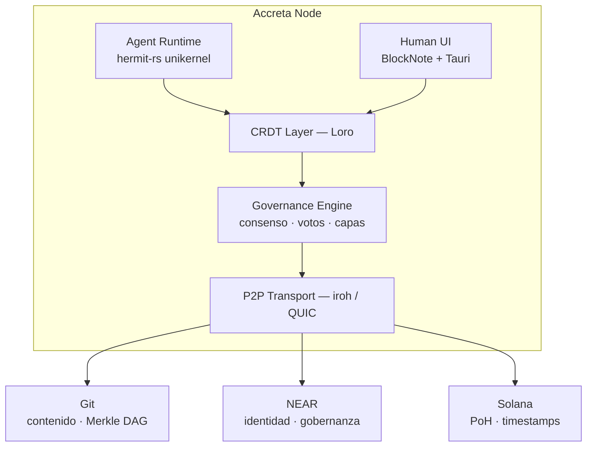

# Arquitectura

## Nodo Accreta



## Stack tecnológico

| Capa | Tecnología | Rol |
|------|-----------|-----|
| Agent runtime | `hermit-rs` + `uhyve` | Agentes como unikernels aislados |
| CRDT | `loro` (Rust) | Edición colaborativa en tiempo real |
| P2P | `iroh` (QUIC) | Descubrimiento y sync sin servidor central |
| Protocolo agentes | MCP + ACP | Compatible con Claude Code, Zed, Cursor |
| Identidad | DID W3C + NEAR | `pm-agent.alice.near` — responsabilidad visible en el DID |
| Gobernanza | NEAR smart contracts | Consenso, asignación de niveles, historial de actores |
| Timestamps | Solana PoH | Prueba criptográfica del orden de eventos |
| Contenido | Git (Merkle DAG) | Content-addressed, historial inalterable |
| Serialización | Markdown + YAML frontmatter | Legible por humanos, diffable en git |
| Frontend | BlockNote + Tauri | Editor Markdown colaborativo, desktop-native |
| Backend | axum + tokio (Rust) | HTTP/WebSocket para la API del nodo |

## Estructura del proyecto

```
accreta/                      (git — specs Accreta)
  overview.md
  concepts/
  integration/
  .stratum/
    worklist/                ← ítems de trabajo del ecosistema
```

Los sub-proyectos del ecosistema son carpetas hermanas siguiendo la convención Stratum:

```
accreta/
  stratum/                   (git — specs Stratum)
  bilinker/                  (git — specs Bilinker)
  impact/                    (git — specs Impact)
  worklist/                  (git — specs Worklist)
```

## Fases de desarrollo

### Fase 0 — Living Spec
UI colaborativa local, CRDT por archivo spec, hilos de discusión, sin agentes.

### Fase 1 — Primer agente distribuido
Un agente BMAD (PM) como unikernel, conectado vía iroh. Gobernanza humana: votos, resolución de consenso. Integración con bilinker para detección de drift.

### Fase 2 — Red de agentes
Roster completo de agentes BMAD. Identidad NEAR: DID para todos los actores. Historial público trazable por actor.

### Fase 3 — Plataforma open source pública
NEAR smart contracts para gobernanza. Solana PoH. Workspaces federados vía iroh P2P. Despliegue self-hosted de agentes.
