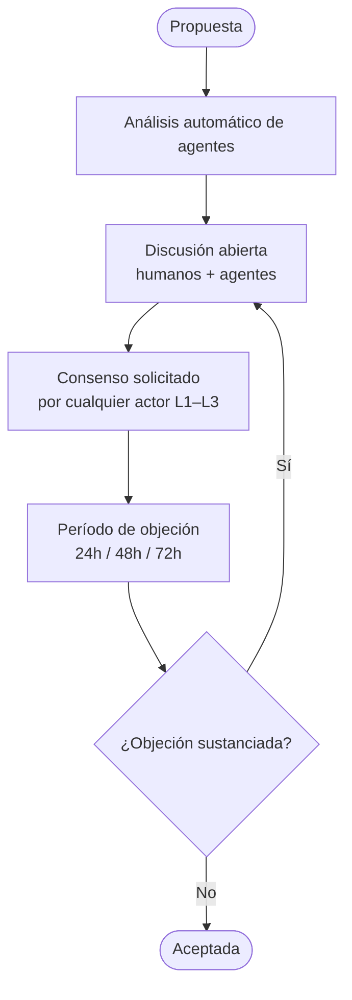

# Gobernanza

Accreta no usa votación por mayoría. Usa **consenso**: una Iteration se acepta cuando no hay objeción sustanciada sin resolver tras un período de discusión.

## Ciclo de vida de una Iteration

## Iteration aceptada → commit git

Cuando una Iteration es aceptada, Accreta produce:

1. Un commit git firmado que aplica el diff CRDT al archivo de spec
2. Un evento on-chain (NEAR) que registra el consenso con timestamp Solana PoH

El evento on-chain prueba la secuencia de eventos y hace el historial inalterable.

## Ejecución de agentes

| Nivel | Mecanismo | Verificación |
|-------|-----------|--------------|
| L1 — Self-hosted | Unikernel en hardware propio, firmado con clave del operador | Firma Ed25519 + historial del operador |
| L2 — Delegado | Peer corre el unikernel; `context_refs` pinned al commit | Firma + context_refs + conversation_log |
| L3 — TEE-attested | Unikernel en enclave hardware (AMD SEV / Intel TDX) | Attestation de hardware + firma |

Los niveles L1 y L2 usan Solana como reloj global. L3 habilita un mercado abierto de ejecución de agentes con prueba criptográfica del entorno.
