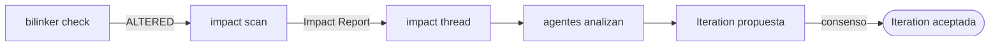

# Integración con impact

Impact alimenta el ciclo de gobernanza de Accreta: cuando detecta drift entre capas, genera los artefactos que disparan Iterations y discusiones.

## Flujo

## Impact Reports como evidencia

Los Impact Reports generados por impact son la evidencia técnica que alimenta las Opinions de los agentes en Accreta. El `context_refs` del agente apunta exactamente al commit analizado.
