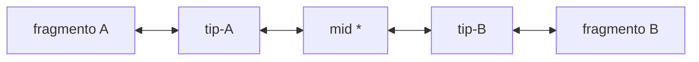
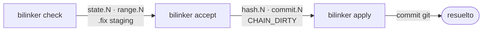

# Arquitectura

## Estructura en el filesystem

Bilinker vive en carpetas `.bilink/` dentro de cada layer del proyecto:

```
proyecto/
  .bilink/
    <uuid>.bilink     ← tip (fragmento en esta layer)
  .stratum/
    tech-decisions/
      .bilink/
        <uuid>.bilink ← mid (conecta capas)
    impl/
      .bilink/
        <uuid>.bilink ← tip (fragmento en impl)
        .pending/
          <uuid>-0.fix
```

El mismo UUID aparece en todas las layers que participan de una cadena.

## Topología de cadena



| Tipo | Endpoint 0 | Endpoint 1 |
|------|-----------|-----------|
| **tip** | estructural (fragmento) | layer (ruta relativa) |
| **mid** | layer | layer |

La cadena es estrictamente lineal — sin ciclos ni bifurcaciones.

## Ciclo check → accept → apply



`check` nunca modifica `hash.N` ni `commit.N`. Solo `bilinker accept` los establece.

## Propagación reactiva

Cada nodo ancla en `hash.N` el SHA-256 del `.bilink` adyacente. Cuando un nodo cambia de estado, su archivo `.bilink` cambia, su hash cambia, y el nodo vecino detecta CHAIN_DIRTY en el próximo `check`:

```mermaid
flowchart TD
    B(["fragmento B cambia"]) --> TB["tip-B\nhash ≠ hash.1 → ALTERED\narchivo tip-B cambia"]
    TB --> M["mid\nhash&#40;tip-B&#41; ≠ hash.1 → CHAIN_DIRTY\narchivo mid cambia"]
    M --> TA["tip-A\nhash&#40;mid&#41; ≠ hash.1 → CHAIN_DIRTY"]
```



Ningún nodo puede cambiar su estado aceptado sin que los nodos adyacentes lo detecten.

## Componentes internos

```
bilinker capture   → tree-sitter parse → query AST → hash SHA-256
bilinker get       → lookup en .bilink/ por range.N → retorna fragmento
bilinker check     → hash actual vs hash.N → estados + .fix staging
bilinker accept    → establece hash.N y commit.N con el estado actual
bilinker apply     → aplica .fix como commit git
bilinker chain     → crea / inspecciona / lista cadenas
```

## Índice opcional

Cada layer puede tener un `.bilink/.index` que mapea archivos fuente a los endpoints que los referencian. Es un derivado regenerable — nunca fuente de verdad. `bilinker get` lo usa si está actualizado; si no, cae a scan O(N). `bilinker index` lo construye o reconstruye explícitamente.

```
bilinker index --recursive   → construye .index en todas las layers
bilinker index status        → reporta si el índice está actualizado
```

Ver especificación completa en [concepts/index.md](concepts/index.md).

## Implementaciones alternativas por branch

Cuando una implementación alternativa vive en una branch de otro repo, la spec tiene su propia branch correspondiente con solo los bilinks alterados:

```
specs/main          impl/main
  A1.bilink           Voting.java
  spec-A → Voting     (implementación canónica)

specs/feature/X     impl/feature/X
  A1.bilink           OptimizedVoting.java
  spec-A → Optimized  (implementación alternativa)
```

Solo `A1.bilink` cambia en la branch de specs — el resto del repo de specs es idéntico a `main`. Mergear `feature/X` en `main` en impl implica mergear la branch correspondiente en specs.

El formato de bilink no cambia — git maneja la variación entre branches.

## Detección de raíz

Bilinker detecta la raíz del proyecto caminando hacia arriba desde cwd, buscando `.bilink/` o `.git/`. Si no encuentra ninguno, usa cwd. No requiere archivo de configuración explícito.
