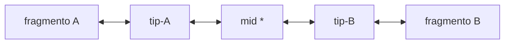
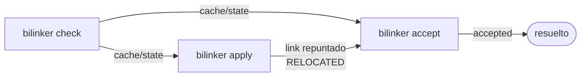
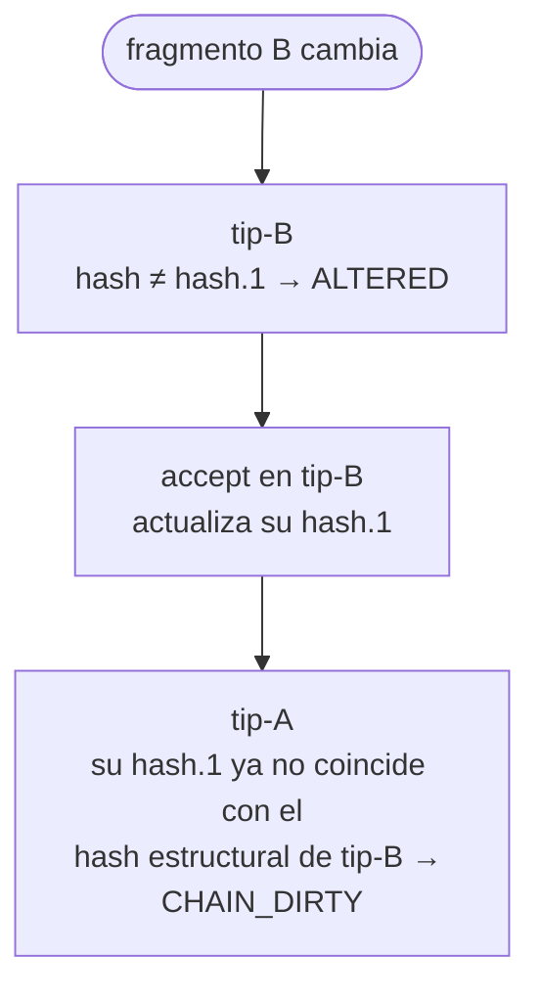

# Arquitectura

## Estructura en el filesystem

Bilinker vive en carpetas `.bilink/` dentro de cada layer del proyecto:

```
proyecto/
  .bilink/
    <uuid>.bilink     ← tip (relación)
    capture/
      <uuid>.capture  ← ubicación del fragmento en esta layer
  .stratum/
    impl/
      .bilink/
        <uuid>.bilink ← tip (relación)
        capture/
          <uuid>.capture
```

El mismo UUID aparece en todas las layers que participan de una cadena.

**Esas carpetas están en el árbol de trabajo y no en ninguna rama del proyecto.** Viven en `refs/bilink/<branch>`, una ref por rama, y el árbol las lleva materializadas y excluidas del índice del proyecto. Ver [la ref de bilinks](concepts/ref.md), que es donde están la invariante de fidelidad, el índice propio y `.bilink/head`.

## Topología de cadena


```mermaid
flowchart LR
    FA["fragmento A"] <--> TA["tip-A"]
    TA <--> M["mid *"]
    M <--> TB["tip-B"]
    TB <--> FB["fragmento B"]
```

| Tipo | Endpoint 0 | Endpoint 1 |
|------|-----------|-----------|
| **tip** | estructural (fragmento) | layer (ruta relativa) |
| **mid** | layer | layer |

La cadena es estrictamente lineal — sin ciclos ni bifurcaciones.

## Ciclo check → accept / apply


```mermaid
flowchart LR
    A[bilinker check] -->|"cache/state"| B[bilinker accept]
    A -->|"cache/state"| C[bilinker apply]
    B -->|"accepted"| D([resuelto])
    C -->|"link repuntado\nRELOCATED"| B
```

`check` resuelve los captures y compara contra `accepted`; todo lo que produce va a [`cache/state`](concepts/cache.md) y nada a git. `accept` es el único que escribe `accepted`. `apply` usa la cache sólo para elegir candidatos: recalcula el fix re-resolviendo contra git y el AST actuales, acuña el capture de la ubicación nueva y repunta el `link`.

**Ningún fix cierra el ciclo solo.** `apply` deja el endpoint en `RELOCATED`, y sale de ahí con `accept`: mover un vínculo a otro fragmento es una decisión, igual que aprobar un contenido.

## Propagación reactiva

Un endpoint `path` **no** ancla en el hash del archivo vecino: guarda una copia del `accepted` del endpoint **estructural** de ese bilink. La distinción es lo que evita la cascada circular — si hasheara el archivo entero, aceptar un endpoint `path` reescribiría su propio archivo y esa escritura volvería al vecino como un cambio, sin que ningún fragmento se hubiera tocado.

Cuando el fragmento de un tip cambia y alguien lo acepta, su `accepted` cambia, y el nodo adyacente ve que la copia que guardaba dejó de coincidir:


```mermaid
flowchart TD
    B(["fragmento B cambia"]) --> TB["tip-B\nhash ≠ hash.1 → ALTERED"]
    TB --> AC["accept en tip-B\nactualiza su hash.1"]
    AC --> TA["tip-A\nsu hash.1 ya no coincide con el\nhash estructural de tip-B → CHAIN_DIRTY"]
```

Ningún nodo puede cambiar su estado aceptado sin que los nodos adyacentes lo detecten.

## El mensaje de la ref es un módulo, no un `format!`

`refmsg` tiene la gramática de [el mensaje de un commit de la ref](concepts/ref.md#el-mensaje-es-el-comando): la arma y la parsea, en el mismo lugar. Que las dos direcciones vivan juntas es lo que hace verificable el round-trip — lo que bilinker escribe se lee de vuelta igual, y sin eso el replay no tiene de dónde salir.

Está aparte de `bilink_ref` a propósito. `bilink_ref` sabe de árboles, padres y refs; `refmsg` no toca git y no conoce el repo: es texto contra una forma estructurada. **El parser es además la superficie que recibe texto de afuera** —un push viene de otra máquina— así que aislarlo es lo que permite decir, y testear, que de acá no sale nunca una línea de comando: sale un `enum` con el que se arma argv.

## El formato vive aparte

El formato de los archivos es un crate propio, `bilink-format`, del que depende todo lo demás:

```
bilink-format     los tipos y su serialización. No resuelve nada.
  └── bilinker    los interpreta: tree-sitter, git, estados
        ├── bilinker-cli
        └── bilinker-lsp
```

La línea que los separa es **qué hace falta para leer un archivo y qué hace falta para juzgarlo**. Un capture dice dónde está un fragmento; saber si el fragmento sigue ahí exige tree-sitter y git, y eso ya no es el formato.

Se ve en `capture.rs`, que era un archivo y ahora son dos: la mitad que describe el capture está en el crate de formato, y el algoritmo que lo produce —el walk-up por el AST, la construcción de la query— se quedó en `bilinker`, porque depende de las gramáticas.

**La versión del crate es la versión del formato**, y se verifica sola. Ver [versión del formato](concepts/format-version.md).

## Componentes internos

```
bilinker capture   → tree-sitter parse → query AST → escribe .capture
bilinker get       → lookup por range del capture → retorna fragmento
bilinker check     → resuelve captures → compara contra accepted → cache/state
bilinker accept    → escribe accepted en el bilink
bilinker apply     → recalcula fix desde git/AST → acuña capture y repunta link
bilinker chain     → crea / inspecciona / lista cadenas
bilinker init      → exclude, refspec y materialización del clon
bilinker sync      → absorbe la rama del proyecto en la ref
bilinker track     → crea la ref de una rama nueva
bilinker adopt     → trae las decisiones de la ref de otra rama
bilinker-lsp       → hover y codeLens sobre find_by_file y get
```

Los cuatro últimos administran [la ref](concepts/ref.md); los demás la usan sin saberlo, porque absorber y commitear son precondiciones que corren adentro de `accept` y `apply`.

`bilinker-lsp` no agrega lógica: expone por LSP las mismas dos llamadas que usa el CLI. Ver [`commands/lsp.md`](commands/lsp.md).

## Índice opcional

Cada layer puede tener un `.bilink/index/index` que mapea archivos fuente a los endpoints que los referencian y al capture de cada uno. Es un derivado regenerable — nunca fuente de verdad. `bilinker get` lo usa si está actualizado; si no, cae a scan O(N). `bilinker index` lo construye o reconstruye explícitamente.

```
bilinker index --recursive   → construye .index en todas las layers
bilinker index status        → reporta si el índice está actualizado
```

Ver especificación completa en [concepts/index.md](concepts/index.md).

## Implementaciones alternativas por branch

Cuando una implementación alternativa vive en una branch de otro repo, la spec tiene su propia branch correspondiente con solo los bilinks alterados:

```
specs/main          impl/main
  A1.bilink           Voting.java
  spec-A → Voting     (implementación canónica)

specs/feature/X     impl/feature/X
  A1.bilink           OptimizedVoting.java
  spec-A → Optimized  (implementación alternativa)
```

Solo `A1.bilink` cambia en la branch de specs — el resto del repo de specs es idéntico a `main`. Mergear `feature/X` en `main` en impl implica mergear la branch correspondiente en specs.

El formato de bilink no cambia — git maneja la variación entre branches.

### Dos ejes que comparten mecanismo

El pareo de ramas de arriba y [la ref de bilinks](concepts/ref.md) usan los dos el nombre de la rama, y no son lo mismo:

| | Qué separa | Cuántas refs hay |
|---|---|---|
| Implementaciones alternativas | una variante de otra: `Voting` contra `OptimizedVoting` | una por rama, en cada repo |
| La ref de bilinks | los bilinks del contenido que describen | una por rama, `refs/bilink/<branch>` |

**Componen, y la composición es literal**: la variante `feature/X` de las specs tiene sus bilinks en `refs/bilink/feature/X`, y ése es exactamente el argumento de [`track`](commands/track.md). Un repo con dos alternativas tiene dos ramas del proyecto y dos refs de bilinks, y cada par se corresponde por nombre.

De ahí sale la respuesta a una pregunta que el pareo dejaba abierta: **qué se hereda al abrir la variante.** `bilinker track feature/X` la contesta — la ref nueva hereda del commit de `refs/bilink/main` cuyo commit absorbido sigue siendo ancestro de `feature/X`, así que la variante arranca con los bilinks que describen el código que efectivamente tiene, y el único `A1.bilink` que cambia es el que alguien repunta a mano.

Y mergear `feature/X` en `main` del lado del contenido no arrastra la ref: eso es [`adopt`](commands/adopt.md), y va en la dirección contraria — las decisiones de `main` entran a la variante, ninguna de la variante sale sola.

## Detección de raíz

Bilinker detecta la raíz del proyecto caminando hacia arriba desde cwd, buscando `.bilink/` o `.git/`. Si no encuentra ninguno, usa cwd. No requiere archivo de configuración explícito.
