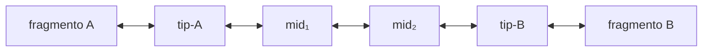
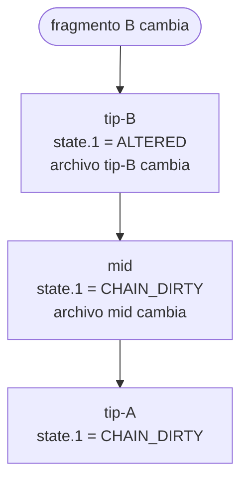

# Especificación: Cadenas de bilinks

## Concepto

Un bilink conecta exactamente dos fragmentos estructurales. Hay dos formas:

- **Link directo** — ambos endpoints en la misma layer, un solo archivo `.bilink`.
  No hay chain traversal. Útil para conectar dos fragmentos dentro de la misma capa.
- **Cadena** — los fragmentos están en layers distintas. El mismo UUID aparece en
  un archivo `.bilink` en cada layer involucrada, con endpoints relativos a su posición.

Una **cadena** es una secuencia lineal de bilinks que conecta dos fragmentos
estructurales a través de las layers de un proyecto.
Todos los bilinks de una cadena comparten el mismo UUID, que es simultáneamente
su identificador de cadena y el nombre de su archivo `.bilink`.

## Topología



| Tipo de nodo | Endpoint 0 | Endpoint 1 | Posición en cadena |
|---|---|---|---|
| **tip** | estructural | layer | extremo (siempre dos por cadena) |
| **mid** | layer | layer | intermedio (cero o más) |

**Restricciones de topología:**
- Exactamente dos tips por cadena.
- Los tips tienen un endpoint estructural y uno layer.
- Los mids tienen ambos endpoints como layer.
- La cadena es estrictamente lineal — sin ciclos ni bifurcaciones.
- Cada archivo `.bilink/<uuid>.bilink` en una layer pertenece a una sola cadena.

## UUID como identificador

El UUID v4 es generado una sola vez al crear la cadena (`bilinker chain new`).
Identifica la cadena y localiza sus nodos: en cualquier layer, el nodo de la cadena
es `.bilink/<uuid>.bilink`.

No existe un archivo de registro central de cadenas — la cadena se descubre
recorriendo los endpoints layer desde cualquier nodo.

## Propagación reactiva

El mecanismo de propagación está integrado en el formato del archivo:

1. `hash.N` de un endpoint layer contiene el SHA-256 del archivo `.bilink`
   referenciado en el momento de la última aceptación.
2. `state.N` es parte del archivo — si cambia, el archivo cambia, su hash cambia.
3. Si el nuevo hash ≠ `hash.N` del nodo adyacente, el próximo `check` detecta CHAIN_DIRTY.

**Flujo de propagación cuando un fragmento cambia:**



No se requiere índice externo para la propagación — la cadena es autosuficiente.

## Estado de la cadena

El estado global de una cadena es el **peor estado** entre todos sus nodos:

| Estado global | Condición |
|---|---|
| OK | Todos los nodos y fragmentos en estado OK |
| DIRTY | Algún nodo tiene CHAIN_DIRTY (propagación de cambio pendiente) |
| BROKEN | Algún nodo tiene estado terminal (ALTERED, DELETED, UNANCHORED, BROKEN) |

## Comandos relacionados

Ver especificación completa en [commands/chain.md](commands/chain.md).

### `bilinker chain new`

Crea una nueva cadena generando un UUID y los archivos `.bilink` en las layers
especificadas:

```bash
bilinker chain new \
  --tip specs "specs :: voting.yaml :: (...) @target" \
  --mid .stratum/tech-decisions \
  --tip .stratum/impl "java-demo :: src/.../Persona.java :: (...) @target"
```

Genera:
- `.bilink/<uuid>.bilink` (tip en spec layer)
- `.stratum/tech-decisions/.bilink/<uuid>.bilink` (mid)
- `.stratum/impl/.bilink/<uuid>.bilink` (tip en impl layer)

### `bilinker chain status <uuid>`

Muestra el estado completo de la cadena recorriendo todos sus nodos:

```bash
$ bilinker chain status 7f3d8e9a-1b2c-4d5e-8f6a-7b8c9d0e1f2a

Chain: 7f3d8e9a-1b2c-4d5e-8f6a-7b8c9d0e1f2a  [DIRTY]

  .bilink/                    (tip)  (OK, CHAIN_DIRTY)
    link.0  specs :: voting.yaml#impl          OK
    link.1  → .stratum/tech-decisions          CHAIN_DIRTY

  .stratum/tech-decisions/    (mid)  (OK, CHAIN_DIRTY)
    link.0  → spec layer                       OK
    link.1  → .stratum/impl                   CHAIN_DIRTY

  .stratum/impl/              (tip)  (CHAIN_DIRTY, ALTERED)
    link.0  → tech-decisions layer             OK  ← se actualizará cuando se resuelva link.1
    link.1  java-demo :: Persona#vote          ALTERED
              AST interno cambió
              source: commit c7d3e9f "Inline comparator"
```

### `bilinker chain list`

Lista todas las cadenas en el proyecto (recursivo desde `.bilink/`):

```bash
$ bilinker chain list

7f3d8e9a  [DIRTY]   spec → tech-decisions → impl  (voting)
3a4b5c6d  [OK]      spec → impl  (reporter)
```

## Ciclo de vida

```
bilinker chain new   → crea archivos .bilink con UUID, sin cache
bilinker check       → compara hash actual contra hash.N, actualiza state.N, range.N, resolved_at
bilinker accept      → establece hash.N y commit.N con el estado actual
bilinker apply       → aplica auto-fixes (MOVED, DISPLACED, REANCHORED, EXPANDED)
bilinker chain status <uuid> → inspecciona cadena completa
```
