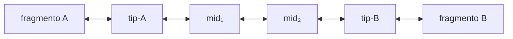
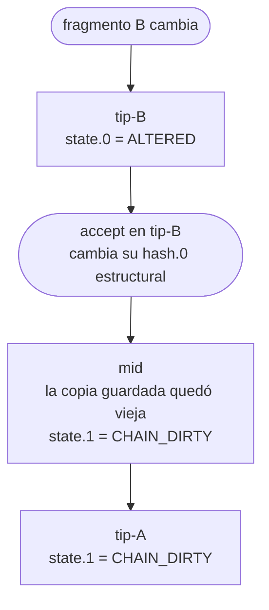

# Especificación: Cadenas de bilinks

## Concepto

Un bilink conecta exactamente dos fragmentos estructurales. Hay dos formas:

- **Link directo** — los dos endpoints en la misma capa, un solo archivo.
  No hay chain traversal. Útil para conectar dos fragmentos dentro de la misma capa.
- **Cadena** — los fragmentos están en layers distintas. El mismo UUID aparece en
  un archivo en cada capa involucrada, con endpoints relativos a su posición.

Una **cadena** es una secuencia lineal de bilinks que conecta dos fragmentos estructurales a través de las layers de un proyecto. Todos los bilinks de una cadena comparten el mismo UUID, que es simultáneamente su identificador de cadena y el nombre de su archivo.

## Topología


```mermaid
flowchart LR
    FA["fragmento A"] <--> TA["tip-A"]
    TA <--> M1["mid₁"]
    M1 <--> M2["mid₂"]
    M2 <--> TB["tip-B"]
    TB <--> FB["fragmento B"]
```

| Tipo de nodo | Endpoint 0 | Endpoint 1 | Posición en cadena |
|---|---|---|---|
| **tip** | estructural (`capture <uuid>`) | layer | extremo (siempre dos por cadena) |
| **mid** | layer | layer | intermedio (cero o más) |

**Restricciones de topología:**
- Exactamente dos tips por cadena.
- Los tips tienen un endpoint estructural —una referencia a un capture de su propia capa— y uno layer.
- Los mids tienen ambos endpoints como layer.
- La cadena es estrictamente lineal — sin ciclos ni bifurcaciones.
- Cada archivo `.bilink/<uuid>.bilink` en una layer pertenece a una sola cadena.

## UUID como identificador

El UUID v4 es generado una sola vez al crear la cadena (`bilinker chain new`). Identifica la cadena y localiza sus nodos: en cualquier layer, el nodo de la cadena es `.bilink/<uuid>.bilink`.

No existe un archivo de registro central de cadenas — la cadena se descubre recorriendo los endpoints layer desde cualquier nodo.

## Propagación reactiva

El mecanismo de propagación está integrado en el formato del archivo:

1. El `accepted` de un endpoint `path` es una **copia** del `accepted` del endpoint estructural del bilink adyacente —su `link` y su `hash`— y no el hash del archivo vecino.
2. Por eso refrescar la cache no propaga: los estados viven fuera del archivo, y un `accepted` sólo cambia con `accept`.
3. Si alguna de las dos copias ≠ la del nodo adyacente, el próximo `check` detecta CHAIN_DIRTY.

**Flujo de propagación cuando un fragmento cambia:**


```mermaid
flowchart TD
    B(["fragmento B cambia"]) --> TB["tip-B\nstate.0 = ALTERED"]
    TB --> AC(["accept en tip-B\ncambia su hash.0 estructural"])
    AC --> M["mid\nla copia guardada quedó vieja\nstate.1 = CHAIN_DIRTY"]
    M --> TA["tip-A\nstate.1 = CHAIN_DIRTY"]
```

No se requiere índice externo para la propagación — la cadena es autosuficiente.

## Estado de la cadena

El estado global de una cadena es el **peor estado** entre todos sus nodos:

| Estado global | Condición |
|---|---|
| OK | Todos los nodos y fragmentos en estado OK |
| DIRTY | Algún nodo tiene CHAIN_DIRTY (propagación de cambio pendiente) |
| BROKEN | Algún nodo tiene estado terminal (ALTERED, DELETED, UNANCHORED, BROKEN) |

## Comandos relacionados

Ver especificación completa en [commands/chain.md](../commands/chain.md).

### `bilinker chain new`

Crea una cadena generando un UUID y un bilink en cada capa:

```bash
bilinker chain new \
  --tip 'commands/check.md:63:1' \
  --tip '>impl/crates/bilinker/src/check.rs:405:1'
```

Genera, por cada tip, un capture en su capa y el bilink que lo referencia:
- `.bilink/capture/<c0>.yaml` + `.bilink/<uuid>.yaml` (tip en la capa spec)
- `.stratum/impl/.bilink/capture/<c1>.yaml` + `.stratum/impl/.bilink/<uuid>.yaml` (tip en la capa impl)

Si un tip apunta a un fragmento ya capturado, el capture es literalmente el mismo archivo: el id sale de la ubicación.

### `bilinker chain status <uuid>`

Muestra el estado completo de la cadena recorriendo todos sus nodos:

```bash
$ bilinker chain status 7f3d8e9a-1b2c-4d5e-8f6a-7b8c9d0e1f2a

Chain: 7f3d8e9a-1b2c-4d5e-8f6a-7b8c9d0e1f2a  [DIRTY]

  .bilink/                    (tip)  (OK, CHAIN_DIRTY)
    link.0  specs :: voting.yaml#impl          OK
    link.1  → .stratum/impl                    CHAIN_DIRTY

  .stratum/impl/              (tip)  (CHAIN_DIRTY, ALTERED)
    link.0  → spec layer                       CHAIN_DIRTY
    link.1  java-demo :: Persona#vote          ALTERED
              AST interno cambió
              source: commit c7d3e9f "Inline comparator"
```

### `bilinker chain list`

Lista todas las cadenas en el proyecto (recursivo desde `.bilink/`):

```bash
$ bilinker chain list

7f3d8e9a  [DIRTY]   spec → impl  (voting)
3a4b5c6d  [OK]      spec → impl  (reporter)
```

## Ciclo de vida

```
bilinker chain new   → crea los bilinks con el UUID, sin accepted
bilinker check       → resuelve captures y compara contra accepted → cache/state
bilinker accept      → escribe accepted con el estado actual
bilinker apply       → repunta link a la ubicación nueva; deja RELOCATED
bilinker chain status <uuid> → inspecciona cadena completa
```
