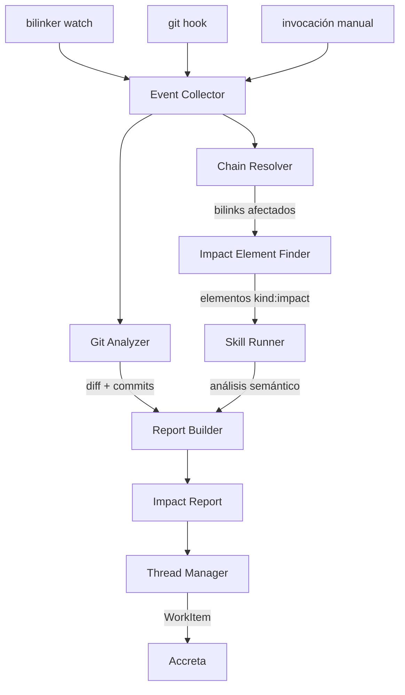
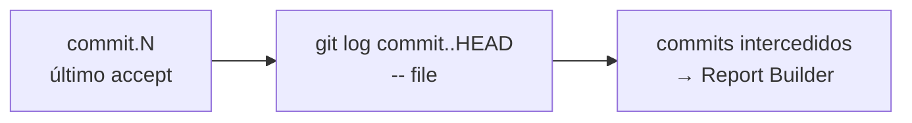
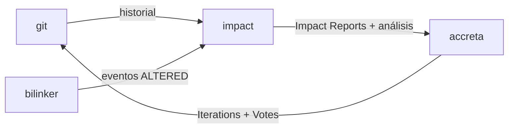

# Arquitectura

## Flujo general



## Componentes internos

### Event Collector
Recibe eventos de múltiples fuentes y los normaliza en un formato uniforme: `{ file, kind: Modified|Created|Deleted, commit? }`.

### Chain Resolver
Dado un archivo, consulta los `.bilink` files de la layer para encontrar todos los bilinks que lo referencian. Devuelve la lista de bilinks con sus endpoints y estado almacenado.

### Impact Element Finder
Dado un bilink afectado, consulta el índice de backlinks en `.bilink/.index` para encontrar todos los bilinks con `kind: impact` que referencian ese bilink en su `link.1`. Cada uno de esos elementos declara un documento de decisión que gobierna el vínculo afectado.

La búsqueda es O(1) por bilink afectado.

### Git Analyzer
Lee el historial de git para obtener los commits que modificaron el archivo desde el último estado conocido. El ancla es `commit.N` del bilink — todo lo posterior son los commits que intercedieron en el cambio.



### Skill Runner
Para cada elemento de impacto encontrado, ejecuta la skill configurada para su layer (o la skill por defecto). Recibe el documento de decisión, el bilink afectado, los commits intercedidos y el blast radius. Produce un análisis semántico como texto.

### Report Builder
Combina la salida del Chain Resolver, el Git Analyzer y el Skill Runner para construir un Impact Report estructurado.

### Thread Manager
Gestiona los hilos de discusión. Cada hilo vive en su propia carpeta bajo `.impact/threads/`.

## Posición en el ecosistema



## Persistencia

```
layer/
  .bilink/
    <uuid>.bilink           ← elementos de impacto (kind: impact) junto al resto
  .impact/
    reports/
      <uuid>.impact
    threads/
      <uuid>/
        thread.md            ← metadata: estado, título, bilinks afectados
        messages/
          0001.md            ← mensaje inicial (el Impact Report)
          0002.md            ← análisis de skill o respuesta humana
          0003.md
  .impact.toml               ← configuración de skills (opcional)
```

Los elementos de impacto viven en `.bilink/` como cualquier otro bilink — no en `.impact/`. `.impact/` contiene solo los artefactos de análisis y discusión.

Todos los archivos son texto plano con frontmatter YAML y cuerpo Markdown — legibles y diffables en git, sin base de datos.
