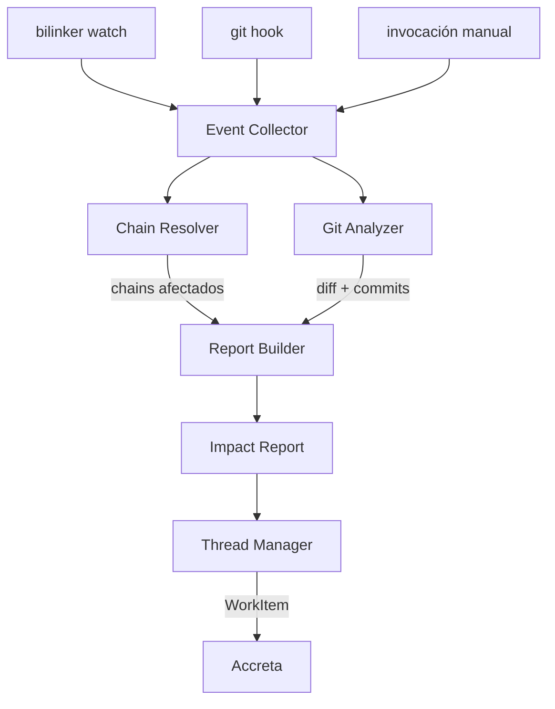
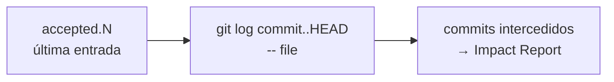
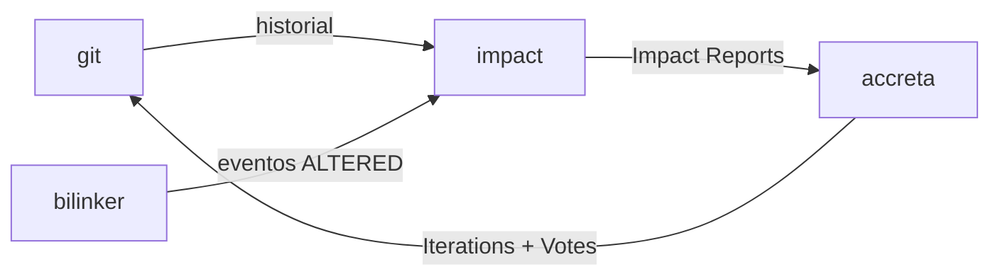

# Arquitectura

## Flujo general



## Componentes internos

### Event Collector
Recibe eventos de múltiples fuentes y los normaliza en un formato uniforme:
`{ file, kind: Modified|Created|Deleted, commit? }`.

### Chain Resolver
Dado un archivo, consulta los `.bilink` files del proyecto para encontrar todos los chains que lo referencian. Devuelve la lista de chains con sus endpoints y el estado almacenado.

### Git Analyzer
Lee el historial de git para obtener los commits que modificaron el archivo desde el último estado conocido. El ancla es el commit de la última entrada en `accepted.N` del bilink — todo lo posterior son los commits que intercedieron en el cambio.



### Report Builder
Combina la salida del Chain Resolver y el Git Analyzer para construir un Impact Report estructurado.

### Thread Manager
Gestiona los hilos de discusión. Cada hilo vive en su propia carpeta bajo `.impact/threads/`.

## Posición en el ecosistema



## Persistencia

```
proyecto/
  .impact/
    reports/
      <uuid>.impact
    threads/
      <uuid>/
        thread.md            ← metadata: estado, título, chains afectados
        messages/
          0001.md            ← mensaje inicial (el Impact Report)
          0002.md            ← respuesta humana o de agente
          0003.md
```

Todos los archivos son texto plano con frontmatter YAML y cuerpo Markdown — legibles y diffables en git, sin base de datos.
