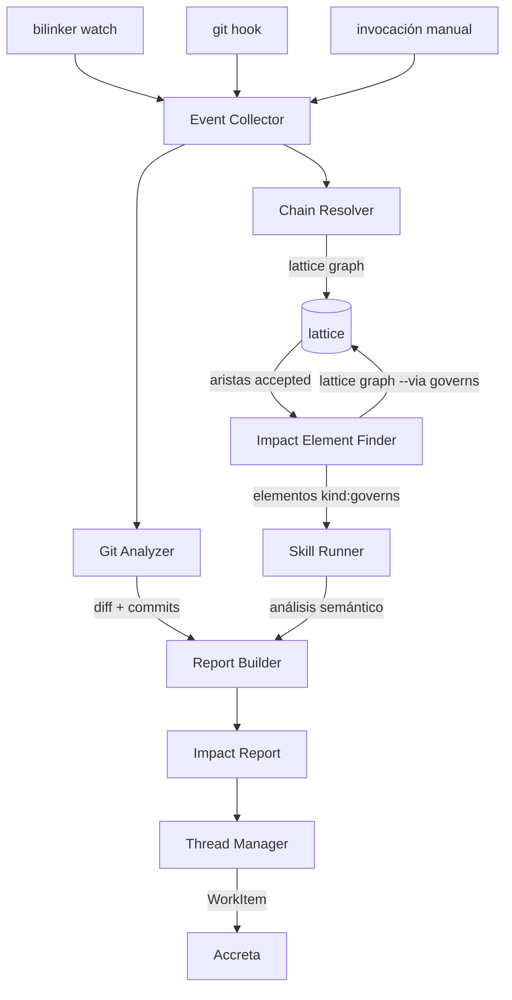
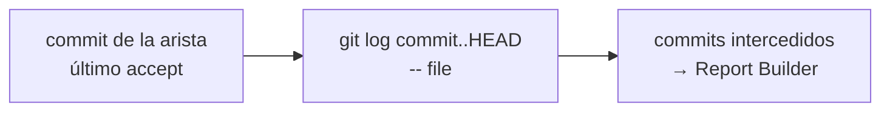
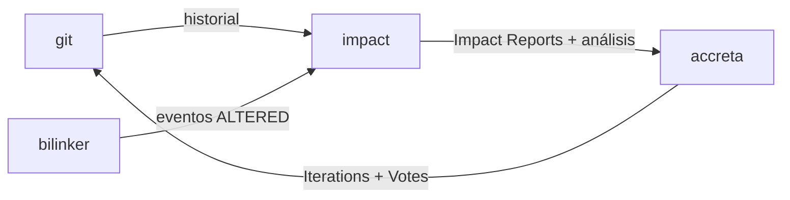

# Arquitectura

## Flujo general


```mermaid
flowchart TD
    E1[bilinker watch] --> EC[Event Collector]
    E2[git hook] --> EC
    E3[invocación manual] --> EC

    EC --> CR[Chain Resolver]
    EC --> GA[Git Analyzer]

    CR -->|lattice graph| LT[(lattice)]
    LT -->|aristas accepted| IE[Impact Element Finder]
    IE -->|lattice graph --via governs| LT
    GA -->|diff + commits| RB[Report Builder]
    IE -->|elementos kind:governs| SK[Skill Runner]
    SK -->|análisis semántico| RB

    RB --> IR[Impact Report]
    IR --> TM[Thread Manager]
    TM -->|WorkItem| AC[Accreta]
```

## Componentes internos

### Event Collector
Recibe eventos de múltiples fuentes y los normaliza en un formato uniforme: `{ file, kind: Modified|Created|Deleted, commit? }`.

### Chain Resolver
Dado un archivo, consulta `lattice graph <archivo> --via bilink` para obtener las aristas que lo alcanzan, con sus nodos, `state` y `commit`.

No lee archivos `.bilink` ni resuelve paths Stratum: lattice entrega las aristas ya resueltas entre capas. Ver [integración con lattice](integration/lattice.md).

### Impact Element Finder
Dado un vínculo afectado, consulta `lattice graph <uuid> --via governs` para encontrar los elementos con `kind: governs` que lo gobiernan. Cada uno declara un documento de decisión.

Las aristas `governs` son no dirigidas: recorrerlas desde el vínculo afectado da sus gobernantes sin necesidad de un índice de backlinks.

### Git Analyzer
Lee el historial de git para obtener los commits que modificaron el archivo desde el último estado conocido. El ancla es el `commit` que trae la arista — todo lo posterior son los commits que intercedieron en el cambio.


```mermaid
flowchart LR
    A[commit de la arista\núltimo accept] --> C[git log commit..HEAD\n-- file]
    C --> R[commits intercedidos\n→ Report Builder]
```

### Skill Runner
Para cada elemento de impacto encontrado, ejecuta la skill configurada para su layer (o la skill por defecto). Recibe el documento de decisión, el bilink afectado, los commits intercedidos y el blast radius. Produce un análisis semántico como texto.

### Report Builder
Combina la salida del Chain Resolver, el Git Analyzer y el Skill Runner para construir un Impact Report estructurado.

### Thread Manager
Gestiona los hilos de discusión. Cada hilo vive en su propia carpeta bajo `.impact/threads/`.

## Posición en el ecosistema


```mermaid
graph LR
    GIT[git] -->|historial| IM[impact]
    BL[bilinker] -->|eventos ALTERED| IM
    IM -->|Impact Reports + análisis| AC[accreta]
    AC -->|Iterations + Votes| GIT
```

## Persistencia

```
layer/
  .bilink/
    <uuid>.bilink           ← elementos de impacto (kind: governs) junto al resto
  .impact/
    reports/
      <uuid>.impact
    threads/
      <uuid>/
        thread.md            ← metadata: estado, título, bilinks afectados
        messages/
          0001.md            ← mensaje inicial (el Impact Report)
          0002.md            ← análisis de skill o respuesta humana
          0003.md
  .impact.toml               ← configuración de skills (opcional)
```

Los elementos de impacto viven en `.bilink/` como cualquier otro bilink — no en `.impact/`. `.impact/` contiene solo los artefactos de análisis y discusión.

Todos los archivos son texto plano con frontmatter YAML y cuerpo Markdown — legibles y diffables en git, sin base de datos.
