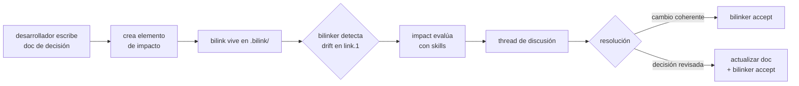

# Elemento de impacto

Un elemento de impacto es un bilink con `kind: impact` que declara que un documento de decisión gobierna o afecta a un vínculo estructural entre capas.

## Estructura

```
# .bilink/<uuid>.bilink
link.0: docs/adr/design-voting-machine.md
link.1: .bilink/7f3d8e9a-1b2c-4d5e-8f6a-7b8c9d0e1f2a.bilink

kind:   impact
name.0: architecture-decision
name.1: spec-impl-bridge

hash.0: b1c2d3e4...
commit.0: d4e5f6a7...
hash.1: e5f6a7b8...
commit.1: f7a8b9c0...
state.0: OK
state.1: OK
resolved_at: 2026-05-29T09:00:00Z
```

`link.0` apunta al documento de decisión: ADR, test spec, documento de arquitectura, descripción de tecnología concreta, o cualquier documento que exprese una decisión con impacto sobre la relación entre capas.

`link.1` apunta a un bilink estructural existente — el vínculo entre capas que este documento gobierna.

## Relación ternaria

Un elemento de impacto genera una relación ternaria implícita en el grafo:

```
docs/adr/design-voting-machine.md
        ↕ (elemento de impacto)
specs/voting.yaml ↔ impl/Voting.java
        (bilink estructural)
```

Esto enriquece el grafo que traversan las herramientas: no solo "A está vinculado a B", sino "A está vinculado a B y este documento de decisión lo gobierna".

## Dónde vive

El elemento de impacto vive en `.bilink/` de la layer donde reside el documento de decisión. El bilink gobernado (`link.1`) puede estar en cualquier layer.

## Descubrimiento

El `.bilink/.index` registra backlinks: para cada bilink, qué otros bilinks lo referencian. Cuando bilinker detecta `ALTERED` o `CHAIN_DIRTY` en un bilink estructural, impact consulta el índice para encontrar todos los elementos de impacto que lo gobiernan. La búsqueda es O(1).

## Ciclo de vida



## `name.N` como contexto semántico

Los campos `name.0` y `name.1` etiquetan el rol de cada extremo en la relación. Son opcionales pero recomendados: permiten que las skills interpreten la relación sin leer el documento completo.

Ejemplos habituales:

| `name.0` | `name.1` |
|----------|----------|
| `architecture-decision` | `spec-impl-bridge` |
| `test-spec` | `implementation` |
| `technology-choice` | `dependency` |
| `invariant` | `enforcement-point` |

## Invariantes

1. `kind: impact` implica que `link.1` es siempre un path `.bilink/<uuid>.bilink`.
2. El documento en `link.0` debe existir localmente para que `bilinker check` lo
   valide — si no existe, `state.0: DELETED`.
3. El bilink gobernado en `link.1` puede estar en una layer no clonada localmente
   — en ese caso `state.1: UNREACHABLE`, sin considerarse error.
4. Un bilink estructural puede tener múltiples elementos de impacto que lo
   gobiernan — cada uno con su propio UUID.
