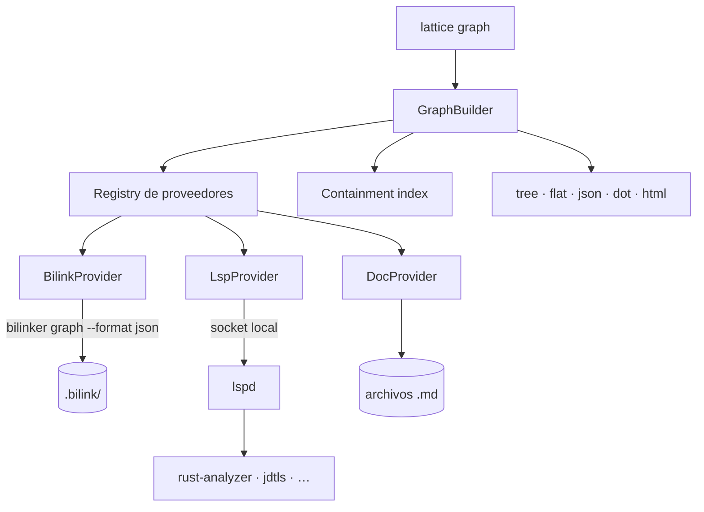

# Arquitectura

## Componentes



| Componente | Responsabilidad |
|---|---|
| **Registry** | Descubre proveedores, consulta disponibilidad, reporta degradación. |
| **GraphBuilder** | Compone las aristas de todos los proveedores, deduplica y resuelve contención. |
| **Containment index** | Responde `cubriendo(pos)` — el puente entre aristas `derived` y `accepted`. |
| **[lspd](../lspd/overview.md)** | Mantiene language servers vivos y responde `callees` / `callers` / `symbol_at`. **No es de lattice**: es una capa aparte, y bilinker también le pregunta. |
| **Renderers** | `tree`, `flat`, `json`, `dot`, `html`. |

El daemon es un binario separado, con su propio ciclo de vida **y su propia capa**. El resto vive en el CLI.

**Que no sea de lattice es la parte que importa.** Su crate nunca dependió de `lattice`, y desde que bilinker también le pregunta, tenerlo adentro se leería como una inversión de capas que no está ocurriendo. Lattice lo consume como cualquier otro: por el socket, con el cliente compartido. Ver [`lspd`](../lspd/overview.md).

## Layout de crates

```
crates/
  lattice/              modelo, registry, builder, containment, traversal
  lattice-cli/          comandos y renderers
  lattice-provider-bilink/   adapta la salida de `bilinker graph --format json`
```

La gestión de language servers **no está acá**: es [`lspd`](../lspd/overview.md), y lattice depende de su crate cliente igual que depende de `stratum`.

## Migración del código existente

Casi todo lo que necesita lattice ya está escrito dentro de bilinker. La migración es mayormente movimiento, no reescritura.

### Se mueve tal cual

| Origen | Destino | Notas |
|---|---|---|
| `crates/bilinker-daemon/` (6 archivos, 712 líneas) | `crates/lattice-daemon/`, y de ahí a [`lspd`](../lspd/overview.md) | **Nada en este crate era específico de bilinks** — y resultó que tampoco de lattice. `LspManager` despacha por extensión, `LspClient` habla `callHierarchy`, `Language` mapea extensión → ejecutable. El socket pasó por tres nombres: `~/.bilinker/daemon.sock` → `~/.lattice/daemon.sock` → `~/.lspd/daemon.sock`. |
| `bilinker/src/daemon.rs` (33 líneas) | `lattice/src/daemon_client.rs`, y de ahí al crate `lspd-client` | Cliente JSON-RPC síncrono. Volvió a mudarse por el mismo motivo: con dos consumidores, el cliente es del daemon. |
| `bilinker-cli/src/main.rs:1217-1460` (`DotGraph` + colectores) | `lattice-cli/src/render/dot.rs` | Renderer puro. |
| `bilinker-cli/src/main.rs:1128-1216` (`graph_tree`, `graph_flat`) | `lattice-cli/src/render/` | Renderers puros. |

### Se mueve y se generaliza

| Origen | Destino | Qué cambia |
|---|---|---|
| `bilinker-cli/src/html_graph.rs` (1103 líneas) | `lattice/src/model.rs` + `lattice-cli/src/render/html.rs` | Hoy mezcla el modelo del grafo con la emisión de HTML. Se parte en dos: el modelo unificado de nodos/aristas queda en `lattice`, el visor Cytoscape en el renderer. |
| `bilinker/src/impact.rs` (316 líneas) | `lattice/src/traverse.rs` | El traversal hacia arriba por `callers`. Hoy asume que el único destino posible es un bilink; se generaliza a "cualquier arista con garantía `accepted`". |
| `bilinker-cli/src/main.rs:1058-1127` (`find_graph_starts`) | `lattice/src/selector.rs` | Resolución de selector. Se unifica con `impact::resolve_selector`, que hace lo mismo con otra forma. |

### Se queda en bilinker

`layer_children`, `visit_key`, `layer_label` y la carga de `BiLinkFile`. Son conocimiento del formato: resuelven la topología de cadena a través de capas. Bilinker los usa para emitir sus aristas ya resueltas por `bilinker graph --format json`.

### Se borra

| Código | Motivo |
|---|---|
| `bilinker/src/sciplink.rs` (164 líneas) | El sistema de sciplinks fue eliminado del spec. Muerto. |
| `bilinker/src/scip_index.rs` (327 líneas) | Ídem — el índice SCIP fue reemplazado por el daemon LSP. |
| `bilinker/src/impact.rs` | Tras mover el traversal a lattice. |
| `bilinker-cli/src/main.rs` — comandos `Impact` y `ScipRetrofit`, campos `subgraph0/1`, flag `--no-subgraph` | Residuos de la era del call graph persistido. |
| `html_graph.rs:47-53` (`ScipLinkData`), `:79-91` (`ScipNode`) | Reemplazados por el nodo unificado. |

## Tres problemas que la migración tiene que resolver

Son deudas visibles en el código actual, no invenciones del spec.

### 1. Dos modelos de nodo en paralelo

`HtmlGraph` mantiene `nodes` + `seen_nodes` para los fragmentos de bilink y `scip_nodes` + `seen_scip_nodes` para los símbolos del call graph, con dedup separado y aristas separadas (`edges` vs `scip_edges`). Son el mismo tipo de cosa —un fragmento de un archivo— vistos por dos proveedores.

El modelo unificado de [concepts/node.md](concepts/node.md) los colapsa en un solo tipo de nodo con identidad canónica, y las aristas se distinguen por `kind` y `guarantee` en vez de por su tipo Rust.

### 2. El desajuste posición ↔ rango

Un bilink localiza un fragmento por **rango de bytes** — el `range` que `check` deja en la cache del capture. El LSP necesita **(línea, columna) del identificador** para `callHierarchy/prepareCallHierarchy`. Hoy el puente entre los dos es `impact.rs:285` — `fn_col_from_source`, un escáner que recorre la línea salteando una lista hardcodeada de keywords (`pub`, `fn`, `def`, `public`, `static`, `abstract`, `synchronized`, …) hasta encontrar el primer identificador.

**Ese dato ya está computado y se descarta dos veces.**

`capture` parte de una posición, resuelve el nodo AST y construye la query. Al hacerlo, `real_name_predicate` (`capture.rs:167`) obtiene el nodo del identificador con `child_by_field_name("name")` y lo emite en la query como una captura con predicado:

```
name: (identifier) @n0 (#eq? @n0 "check_structural")
```

O sea que **la query almacenada en el capture ya localiza el identificador**, no solo el fragmento. Y al resolverla, `find_target_with_sexp` (`query.rs:27-33`) itera todas las capturas del match y descarta las que no son `@target` — incluida `@n0`.

La resolución del anclaje no necesita parsing nuevo: es devolver esa captura. `cap.node.start_position()` da un `Point` de tree-sitter, que ya es `(row, column)` — exactamente el formato que espera el LSP, sin conversión de bytes a líneas.

```
1. captura @n0 de la query almacenada          ← ya se computa, hoy se descarta
2. symbol_at(file, line, col) del daemon        ← endpoints sin predicado de nombre
3. heurística por keywords                      ← eliminar
```

El paso 2 cubre los endpoints cuya query no tiene predicado de nombre: `real_name_predicate` devuelve string vacío cuando el nodo no tiene campo `name`. El paso 3 desaparece.

### 3. Dos clientes del daemon

`bilinker/src/daemon.rs:9` implementa `rpc(method, params)`, y `html_graph.rs:360-394` implementa otra vez `daemon_ping` y `daemon_callees_rpc` con el mismo protocolo. Se unifican en `lattice/src/daemon_client.rs`.

## Degradación

`HtmlGraph.daemon_ok: Option<bool>` ya rastrea si el daemon respondió. Lattice lo generaliza: el registry consulta `available()` de cada proveedor antes de componer, y **todo resultado lleva la lista de proveedores que participaron y los que no**.

```
$ lattice graph . --up

warn: proveedor lsp no disponible — 0 aristas `call` en este grafo
```

Un análisis sobre un grafo degradado sigue siendo válido; lo que no es válido es que el consumidor no pueda distinguirlo de uno completo.

## Persistencia

Ninguna. Lattice no escribe archivos.

Las aristas `accepted` las persiste su dueño (bilinker, en sus bilinks); las `derived` se consultan al daemon en cada query; las `asserted` se releen del texto. El único estado en disco que toca lattice es el socket del daemon (`~/.lattice/daemon.sock`, `daemon.pid`).

El índice de contención se construye en memoria por query, sobre `.bilink/index/index` cuando está disponible (O(1)) y con scan O(N) cuando no — el mismo fallback que ya usa `find_by_file`.
