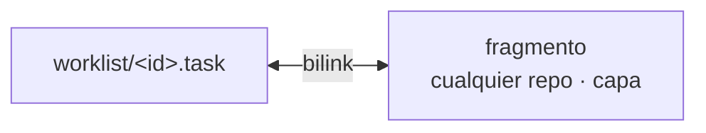
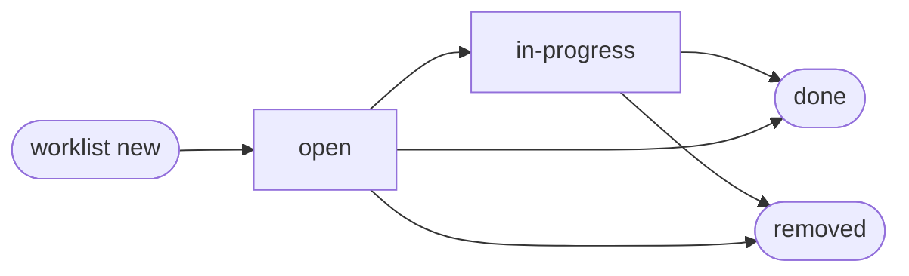

# Arquitectura

## Ubicación

Worklist vive en una única capa dentro del proyecto principal Accreta:

```
accreta/
  .stratum/
    worklist/
      1.epic
      1/
        2.user-story
        2/
          3.task
        4.task
      5.user-story
      5/
        6.task
      7.task
      <bilink-uuid>.tasks   ← índice de tasks por bilink
```

La carpeta homónima al ítem solo existe si ese ítem tiene hijos.

## Tipos de ítem

| Tipo | Extensión | Descripción |
|------|-----------|-------------|
| **Epic** | `.epic` | Objetivo de alto nivel. Agrupa user stories o tasks. |
| **User Story** | `.user-story` | Funcionalidad desde la perspectiva del usuario. Agrupa tasks. |
| **Task** | `.task` | Unidad de trabajo concreta y ejecutable. No tiene hijos. |

Cualquier tipo puede existir en el nivel raíz. Un task puede ser hijo directo
de un epic sin story intermedia.

## Identificación

Cada ítem tiene un ID base-36 corto asignado por el servidor al momento de
creación. El contador vive en el servidor — no hay asignación local.

```bash
worklist show 3     # ítem con ID 3
worklist show 1f    # ítem con ID 1f
```

## Servidor git

Worklist vive en un repositorio git central. Crear un ítem requiere
conectividad: el cliente empuja una solicitud al servidor y hace fetch para
recibir el ítem con su ID asignado.

```mermaid
sequenceDiagram
    participant C as cliente
    participant S as servidor worklist (git)
    C->>S: push solicitud a .pending/
    S->>S: asigna next ID base-36
    S->>S: crea &lt;id&gt;.task
    S->>S: actualiza &lt;bilink-uuid&gt;.tasks
    S->>S: commit "task &lt;id&gt;: título"
    C->>S: git fetch worklist
    S-->>C: &lt;id&gt;.task
    S-->>C: &lt;bilink-uuid&gt;.tasks
```

El historial de git del servidor es el log canónico de todos los ítems creados,
en orden, con IDs legibles.

## Archivo `.tasks` por bilink

Cuando un ítem se crea con `--bilink <uuid>` o con un selector que produce un
bilink, el servidor actualiza (o crea) `<bilink-uuid>.tasks` en la raíz del
worklist. El archivo contiene un ID por línea:

```
# 7f3d8e9a-1b2c-4d5e-8f6a-7b8c9d0e1f2a.tasks
3
1a
2f
```

Verificar si un bilink tiene trabajo pendiente es una comprobación de existencia
de archivo — O(1). Leer los IDs de las tasks es O(1).

## Relación con bilinker

Cada ítem nace linkedeado al fragmento que lo origina, en cualquier capa o repo
del ecosistema. `worklist new` crea el ítem y el bilink en un solo paso:



El selector se resuelve desde el directorio actual en la terminal — no hace falta
especificar el repo o la capa.

## Formato de archivo

```markdown
---
title: <string>
status: open | in-progress | done
created_at: <iso8601-utc>
updated_at: <iso8601-utc>
source_bilink: <uuid>
---

Descripción opcional.
```

`source_bilink` es el UUID del bilink que conecta este ítem con el fragmento
que lo origina. Puede apuntar a un fragmento en cualquier capa o repo.

## Ciclo de vida



`done`: el trabajo está completo.
`removed`: el ítem ya no aplica — el fragmento que lo originó cambió o fue eliminado.
