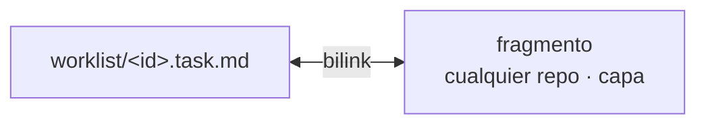
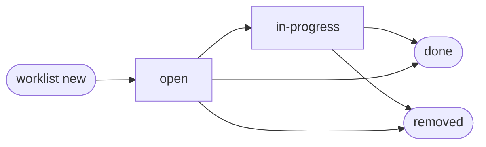

# Arquitectura

## Ubicación

Worklist vive en una única capa dentro del proyecto principal Accreta:

```
accreta/
  .stratum/
    worklist/
      1.epic.md
      2.user-story.md       ← parent: 1
      3.task.md             ← parent: 2
      4.task.md             ← parent: 2
      5.user-story.md       ← parent: 1
      6.task.md             ← parent: 5
      7.task.md             ← sin parent
      _sprints/
        1.sprint.md
```

Todos los ítems son archivos sueltos en la raíz. La jerarquía la declara el campo `parent`; ver [ítem](concepts/item.md) § "Jerarquía". El único directorio es `_sprints/`, y lleva `_` porque ningún directorio de `worklist/` puede ser un ítem.

## Tipos de ítem

| Tipo | Sufijo | Descripción |
|------|--------|-------------|
| **Epic** | `.epic.md` | Objetivo de alto nivel. Agrupa user stories o tasks. |
| **User Story** | `.user-story.md` | Funcionalidad desde la perspectiva del usuario. Agrupa tasks. |
| **Task** | `.task.md` | Unidad de trabajo concreta y ejecutable. No tiene hijos. |
| **Sprint** | `.sprint.md` | Iteración. Vive en `_sprints/` y agrupa por referencia. |

Cualquier tipo puede estar en la raíz del árbol. Un task puede ser hijo directo de un epic sin story intermedia.

## Identificación

Cada ítem tiene un ID base-36 corto asignado por el servidor al momento de creación. El contador vive en el servidor — no hay asignación local.

```bash
worklist show 3     # ítem con ID 3
worklist show 1f    # ítem con ID 1f
```

## Servidor git

Worklist vive en un repositorio git central. Crear un ítem requiere conectividad: el cliente empuja una solicitud al servidor y hace fetch para recibir el ítem con su ID asignado.

```mermaid
sequenceDiagram
    participant C as cliente
    participant S as servidor worklist (git)
    C->>S: push solicitud a .pending/
    S->>S: asigna next ID base-36
    S->>S: crea &lt;id&gt;.task.md
    S->>S: commit "task &lt;id&gt;: título"
    C->>S: git fetch worklist
    S-->>C: &lt;id&gt;.task.md
```

El historial de git del servidor es el log canónico de todos los ítems creados, en orden, con IDs legibles.

## Relación con bilinker

Cada ítem nace linkedeado al fragmento que lo origina, en cualquier capa o repo del ecosistema. `worklist new` crea el ítem y el bilink en un solo paso:


```mermaid
flowchart LR
    T["worklist/&lt;id&gt;.task.md"] <-->|bilink| F["fragmento\ncualquier repo · capa"]
```

El selector se resuelve desde el directorio actual en la terminal — no hace falta especificar el repo o la capa.

## Formato de archivo

```markdown
---
title: <string>
status: open | in-progress | done
created_at: <iso8601-utc>
updated_at: <iso8601-utc>
parent: <id>
---

Descripción opcional.
```

`parent` es opcional y lleva el id del ítem padre. La asociación con el bilink que originó el ítem **no** vive acá: se declara desde el bilink. Ver [asociación tarea ↔ bilink](concepts/bilink-tasks.md).

## Ciclo de vida


```mermaid
flowchart LR
    A([worklist new]) --> B[open]
    B --> C[in-progress]
    C --> D([done])
    B --> D
    C --> E([removed])
    B --> E
```

`done`: el trabajo está completo. `removed`: el ítem ya no aplica — el fragmento que lo originó cambió o fue eliminado.
