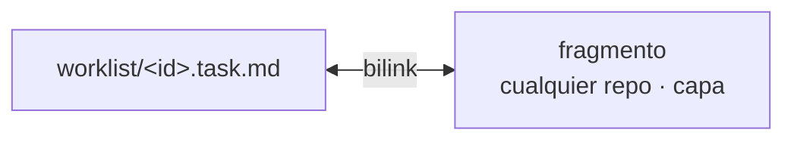

# Arquitectura

## Ubicación

Worklist vive en una única capa dentro del proyecto principal Accreta:

```
accreta/
  .stratum/
    worklist/
      1.epic.md
      2.user-story.md       ← parent: 1
      3.task.md             ← parent: 2
      4.task.md             ← parent: 2
      5.user-story.md       ← parent: 1
      6.task.md             ← parent: 5
      7.task.md             ← sin parent
```

Todos los ítems son archivos sueltos en la raíz. La jerarquía la declara el campo `parent`; ver [ítem](concepts/item.md) § "Jerarquía". Los directorios reservados —`.metadata/`, `.bilink/`— llevan punto adelante, porque ningún directorio de `worklist/` puede ser un ítem; ver [jerarquía](concepts/hierarchy.md) § "Los directorios reservados llevan punto adelante".

## Tipos de ítem

| Tipo | Sufijo | Descripción |
|------|--------|-------------|
| **Epic** | `.epic.md` | Objetivo de alto nivel. Agrupa user stories o tasks. |
| **User Story** | `.user-story.md` | Funcionalidad desde la perspectiva del usuario. Agrupa tasks. |
| **Task** | `.task.md` | Unidad de trabajo concreta y ejecutable. No tiene hijos. |

El sprint no es un tipo de ítem: es una entrada de `.metadata/product.yaml`, del servidor — ver [`concepts/composition.md`](concepts/composition.md).

Cualquier tipo puede estar en la raíz del árbol. Un task puede ser hijo directo de un epic sin story intermedia.

## Identificación

Un ítem nace con un id local marcado —`@<slug>`, escrito por quien lo crea— y al sincronizar el servidor se lo reemplaza: por la clave del proveedor si hay uno configurado, o por el siguiente id de su contador base-36 si no lo hay. **Un id a la vez**, y ninguno de los dos sobrevive al otro.

```bash
worklist show 3                   # ítem con ID 3
worklist show @arreglar-el-hook   # todavía sin sincronizar
```

El detalle —el alfabeto, por qué un slug descriptivo y no un contador leído del filesystem— está en [`concepts/item.md`](concepts/item.md) § "Identificación".

## Servidor git

Worklist vive en un repositorio git central, y **crear un ítem no lo necesita**: es escribir un archivo con su `@<slug>`. El servidor entra cuando el trabajo se empuja, y ahí resuelve el id.

```mermaid
sequenceDiagram
    participant C as cliente
    participant S as servidor worklist (git)
    C->>C: escribe @&lt;slug&gt;.task.md
    C->>S: push de la vista
    S->>S: asigna el id — clave del proveedor, o next base-36
    S->>S: rename @&lt;slug&gt; -> &lt;id&gt;, y reescribe lo que lo nombraba
    C->>S: git fetch
    S-->>C: &lt;id&gt;.task.md
```

**El historial de git del servidor es el log canónico**, y de paso es el único mapa entre un id local y el que lo reemplazó: los `rename @&lt;slug&gt; -> &lt;id&gt;` están todos ahí, en orden.

## Relación con bilinker

Cada ítem nace linkedeado al fragmento que lo origina, en cualquier capa o repo del ecosistema. `worklist new` crea el ítem y el bilink en un solo paso:


```mermaid
flowchart LR
    T["worklist/&lt;id&gt;.task.md"] <-->|bilink| F["fragmento\ncualquier repo · capa"]
```

El selector se resuelve desde el directorio actual en la terminal — no hace falta especificar el repo o la capa.

## Formato de archivo

```markdown
---
title: <string>
status: open | in-progress | done
created_at: <iso8601-utc>
updated_at: <iso8601-utc>
parent: <id>
---

Descripción opcional.
```

`parent` es opcional y lleva el id del ítem padre. La asociación con el bilink que originó el ítem **no** vive acá: se declara desde el bilink. Ver [asociación tarea ↔ bilink](concepts/bilink-tasks.md).

## Ciclo de vida


```mermaid
flowchart LR
    A([worklist new]) --> B[open]
    B --> C[in-progress]
    C --> D([done])
    B --> D
    C --> E([removed])
    B --> E
```

`done`: el trabajo está completo. `removed`: el ítem ya no aplica — el fragmento que lo originó cambió o fue eliminado.

## Cliente y servidor son dos binarios

`worklist` en la máquina de quien trabaja, `worklist-server` en el servidor git. Quién se queda con qué subcomando, y por qué el cliente no puede tener credenciales del proveedor: [el corte entre el cliente y el servidor](concepts/distribution.md).
