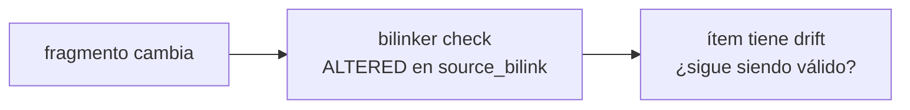

# Drift de un ítem

Un ítem de worklist tiene drift cuando el fragmento al que apunta su
`source_bilink` cambió desde que el ítem fue creado. El ítem sigue apuntando
al mismo fragmento, pero ese fragmento ya no es el mismo.

## Cómo se detecta

`bilinker check` reporta `ALTERED` o `CHAIN_DIRTY` en el `source_bilink` del
ítem. Ninguna herramienta modifica el ítem automáticamente — el drift es una
señal, no una acción.

## Qué hacer

El desarrollador evalúa el fragmento actual y decide:

| Situación | Acción |
|-----------|--------|
| El ítem sigue siendo válido pero el fragmento cambió | `worklist new ... capture <fragmento-nuevo>` reemplazando el ítem, o actualizar manualmente `source_bilink` |
| El trabajo ya fue hecho por el cambio mismo | `worklist done <id>` |
| El ítem ya no aplica por el cambio | `worklist remove <id>` |

## Lo que NO hace el sistema

- No marca el ítem como `stale` ni cambia su `status` automáticamente
- No bloquea completar el ítem aunque haya drift
- No modifica el bilink origen

El drift es información, no un error. La decisión es siempre del desarrollador.

## Relación con impact

Cuando un fragmento con drift tiene un impacto amplio en otras capas, `impact scan`
abre un hilo de discusión para evaluar el alcance antes de decidir qué hacer con
los ítems afectados. Ver [integración con impact](../integration/impact.md).
