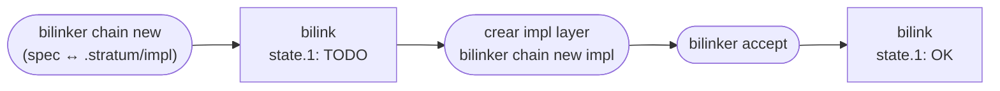

# Bilink con layer no creada todavía

Un bilink puede declarar un endpoint layer apuntando a una capa que aún no existe. El estado `TODO` indica que la conexión está planeada pero la capa destino no fue creada — no es un error.

## Formato

```
link.0: specs/voting.yaml :: (block_mapping_pair ...)
link.1: .stratum/impl

# Cache
hash.0: a1b2c3...
state.0: OK
state.1: TODO
resolved_at: 2026-05-29T09:00:00Z
```

`state.1: TODO` es calculado por `bilinker check` cuando el target layer no existe y `hash.1` está ausente. Una vez creada la capa y aceptado el endpoint, el estado pasa a `OK`.

## Distinción TODO vs BROKEN

| Condición | Estado |
|---|---|
| `hash.N` ausente + layer no existe | `TODO` — intencional, aún no creada |
| `hash.N` presente + layer desapareció | `BROKEN` — regresión |

## Ciclo de vida



### Creación

```bash
# Declara que spec/voting.yaml debería conectarse a la impl layer
bilinker chain new specs/voting.yaml .stratum/impl
```

Crea `.bilink/<uuid>.bilink` con `link.1: .stratum/impl`. El estado es `TODO` hasta que la impl layer exista y sea aceptada.

### Completar

```bash
# Una vez creada la impl layer
bilinker accept <uuid>.1
```

Acepta el endpoint layer — el estado pasa a `OK`.

## Relación con worklist

Un bilink de layer `TODO` puede coexistir con un bilink de tarea asociado (ver [asociación tarea ↔ bilink](bilink-tasks.md)). La tarea en worklist representa el trabajo que creará la layer.
