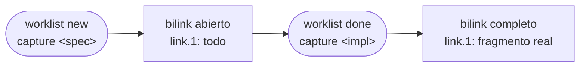

# Bilink abierto

Un **bilink abierto** es un bilink con un endpoint `todo` — declara que un fragmento debería estar conectado a algo que aún no existe. Es la representación de una intención pendiente dentro del sistema de linking.

## Formato

```
link.0: specs/voting.yaml :: (block_mapping_pair ...)
link.1: todo

# Cache
hash.0: a1b2c3...
state.0: OK
state.1: TODO
resolved_at: 2026-05-29T09:00:00Z
```

`link.1: todo` es un endpoint placeholder. No tiene `hash.N`, `commit.N` ni `range.N`. `bilinker check` reporta su estado como `TODO` — no es un error.

## Ciclo de vida



### Creación

```bash
worklist new task "implementar vote en Persona" capture specs/voting.yaml:104:1
```

Crea:
- `.bilink/<uuid>.bilink` con `link.0: specs/voting.yaml::...` y `link.1: todo`
- `worklist/<id>.task` con `source_bilink: <uuid>`
- `worklist/<uuid>.tasks` con `<id>`

### Completar

```bash
worklist done 3 capture src/Persona.java:45:1
```

Reemplaza `link.1: todo` con el endpoint capturado. El bilink queda completo y la task se marca `done`.

### Cerrar sin completar

```bash
worklist done 3
```

Marca la task `done` sin modificar el bilink. El bilink abierto permanece — puede completarse o eliminarse por separado con `bilinker remove`.

## Visibilidad en el grafo

`bilinker graph` muestra los bilinks abiertos como nodos con un extremo `[todo]`:

```
specs/voting.yaml :: impl
└── a3f9c821  [OK ↔ TODO]
       link.0  specs/voting.yaml :: impl
       link.1  todo
```

`bilinker graph --state todo` lista todos los bilinks abiertos del proyecto — el inventario completo de intenciones pendientes.

## Relación con worklist

Un bilink abierto siempre tiene una task asociada en worklist. La task es el trabajo que justifica la existencia del bilink abierto. Cuando la task se completa con `capture`, el bilink se cierra y la conexión queda establecida.

Ver [archivo `.tasks` por bilink](bilink-tasks.md).
