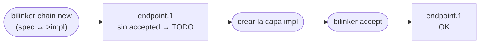

# Bilink con layer no creada todavía

Un bilink puede declarar un endpoint layer apuntando a una capa que aún no existe. El estado `TODO` indica que la conexión está planeada pero la capa destino no fue creada — no es un error.

## Formato

```yaml
# .bilink/<uuid>.yaml
endpoint:
  0:
    link: capture 67ba7217e0334051becd4921b55a7872
    accepted:
      link: capture 67ba7217e0334051becd4921b55a7872
      hash: a1b2c3d4e5f6a7b8c9d0e1f2a3b4c5d6e7f8a9b0c1d2e3f4a5b6c7d8e9f0a1b2
  1:
    link: path >impl
```

El endpoint 1 **no tiene `accepted`**, y eso *es* el estado pendiente: no hay que enunciarlo en ningún campo. `bilinker check` lo reporta como `TODO` —en vez de `PENDING`— cuando además la capa apuntada no existe todavía. Ese estado vive en [la cache](../../bilinker/concepts/cache.md), no en el archivo.

Una vez creada la capa y aceptado el endpoint, pasa a `OK`.

## Distinción TODO vs BROKEN

| Condición | Estado |
|---|---|
| `accepted` ausente + capa no existe | `TODO` — intencional, aún no creada |
| `accepted` presente + capa desapareció | `BROKEN` — regresión |

## Ciclo de vida


```mermaid
flowchart LR
    A(["bilinker chain new\n(spec ↔ >impl)"]) --> B["endpoint.1\nsin accepted → TODO"]
    B --> C(["crear la capa impl"])
    C --> D(["bilinker accept"])
    D --> E["endpoint.1\nOK"]
```

### Creación

```bash
# Declara que specs/voting.yaml debería conectarse a la capa impl
bilinker chain new --tip 'specs/voting.yaml:12:1' --tip '>impl'
```

Crea `.bilink/<uuid>.yaml` con `link: path >impl` en el endpoint 1. El estado es `TODO` hasta que la capa exista y sea aceptada.

### Completar

```bash
# Una vez creada la impl layer
bilinker accept <uuid>.1
```

Acepta el endpoint layer — el estado pasa a `OK`.

## Relación con worklist

Un endpoint `path` en `TODO` puede coexistir con un bilink de tarea asociado (ver [asociación ítem ↔ bilink](bilink-tasks.md)). El ítem del worklist representa el trabajo que creará la capa.
